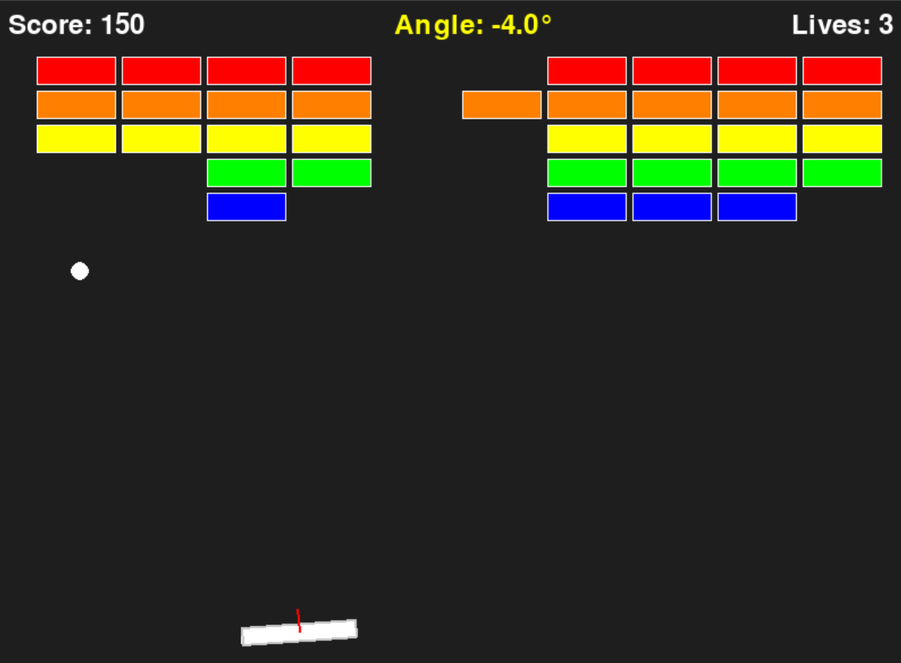
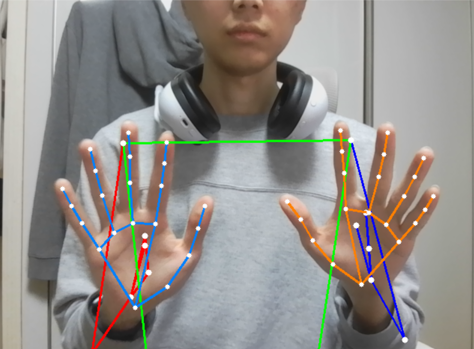

# Skeleton Breakout 🎮

손 인식 기반 벽돌깨기 게임입니다. 웹캠으로 손을 인식하여 손의 골격 선분으로 공을 튕겨 벽돌을 깨는 게임입니다.


## 주요 기능

- **손 인식 패들**: 기존 벽돌깨기의 패들 대신 손의 골격 선분이 공을 튕김
- **실시간 웹캠 배경**: 게임 배경에 웹캠 영상이 실시간으로 표시
- **물리 기반 반사**: 손 선분의 기울기에 따른 입사각 반사 계산
- **하드 모드**: 손 선분에 체력이 부여되어 충돌 시 체력 감소, 체력 소진 시 해당 손가락 그룹 비활성화
- **향상된 충돌 감지**: CCD(연속 충돌 감지), 서브스텝 시뮬레이션으로 정확한 충돌 처리

## 기술 스택

| 분류 | 기술 |
|------|------|
| Language | Python 3.8+ |
| Game Engine | Pygame |
| Computer Vision | OpenCV |
| Hand Tracking | MediaPipe |
| Math | NumPy |

## 설치

### 1. 저장소 클론
```bash
git clone https://github.com/Dakae/skeleton_breakout.git
cd skeleton_breakout
```

### 2. 의존성 설치
```bash
pip install -r requirements.txt
```

### 3. MediaPipe 모델 다운로드
`models/` 폴더에 아래 파일들을 다운로드하세요:
- [hand_landmarker.task](https://storage.googleapis.com/mediapipe-models/hand_landmarker/hand_landmarker/float16/latest/hand_landmarker.task)

## 실행

```bash
python skeleton_breakout.py
```

## 조작법

| 키 | 기능 |
|---|------|
| **마우스 클릭** | 메뉴에서 버튼 선택 |
| **Enter / Space** | 게임 시작 |
| **R** | 재시작 |
| **M** | 메인 메뉴로 돌아가기 |
| **F** | FPS 표시 토글 |
| **D** | 디버그 정보 토글 |
| **ESC** | 종료 |

## 게임 모드

### Normal Mode
- 기본 모드
- 손 선분이 사라지지 않음

### Hard Mode
- 각 손가락/손바닥 그룹에 체력(기본 3) 부여
- 공과 충돌할 때마다 체력 감소
- 체력이 0이 되면 해당 그룹 비활성화 (점선으로 표시)

## 프로젝트 구조

```
skeleton_breakout/
├── skeleton_breakout.py  # 메인 게임 파일
├── skeleton.py           # 스켈레톤 인식 모듈
├── breakOut.py           # 벽돌깨기 기본 클래스
├── models/               # MediaPipe 모델 파일
│   └── hand_landmarker.task
├── resources/            # 스크린샷 및 데모 파일
├── requirements.txt
└── README.md
```

## 개발 기간

**2025.01.19 ~ 2025.01.24** (6일)

## 라이선스

MIT License

---

# 상세 설명

## 개발 배경

이 프로젝트는 기존의 벽돌깨기 게임과 MediaPipe 손 인식 기술을 결합하여 만들어졌습니다.

### 기존 벽돌깨기 (breakOut.py)



- 전통적인 벽돌깨기 게임
- 키보드 좌우 방향키로 패들 조작
- 패들 기울기에 따른 반사각 계산

### 신체 포즈 인식 (skeleton.py)



- MediaPipe를 활용한 실시간 손/신체 랜드마크 인식
- 21개의 손 랜드마크 포인트 추적
- 손가락별 그룹화 (엄지, 검지, 중지, 약지, 새끼, 손바닥)

## 게임 플레이

### Normal Mode


- 손의 골격 선분으로 공을 튕겨 벽돌을 깨는 기본 모드
- 선분의 기울기에 따라 공의 반사각이 결정됨
- 양손 모두 사용 가능

### Hard Mode


- 각 손가락/손바닥 그룹에 **체력(HP)** 이 부여됨
- 공과 충돌할 때마다 해당 그룹의 체력이 1씩 감소
- 체력이 0이 되면 해당 그룹이 **비활성화** (회색 점선으로 표시)
- 비활성화된 선분은 공과 충돌하지 않음
- 손가락을 아끼면서 전략적으로 플레이해야 함!

## 기술적 특징

### 충돌 감지 시스템

- **CCD (Continuous Collision Detection)**: 빠르게 움직이는 공이 선분을 통과하는 것을 방지
- **서브스텝 시뮬레이션**: 프레임당 8번의 충돌 체크로 정확도 향상
- **신뢰도 기반 필터링**: 랜드마크 신뢰도가 낮은 선분은 충돌 처리 제외

### 성능 최적화

- 스켈레톤 추적 주기 조절 (2프레임마다)
- 전신 포즈 추적 비활성화 (손만 추적)
- 해상도 최적화 (640x480)
